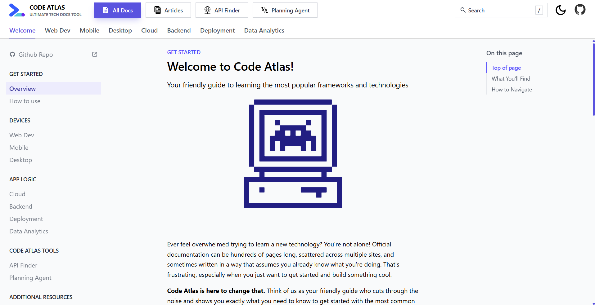

# Code Atlas v2

<div align="center">
  
</div>

## Overview

**Code Atlas** is your comprehensive documentation hub designed specifically for developers who want quick access to essential programming concepts without getting lost in overwhelming documentation. Whether you're just starting your software engineering journey or need a quick reference for specific topics, Code Atlas provides curated, concise guides that get you up to speed fast.

## Features

### Documentation Hub
- **Web Development**: Learn React, Vue, Svelte, and modern web frameworks
- **Mobile Apps**: Get started with React Native, Flutter, and iOS/Android development
- **Backend & Databases**: Build servers with Node.js, Python, and work with databases
- **Cloud & Deployment**: Deploy your apps to AWS, Vercel, Netlify, and other platforms

### Specialized Tools
- **API Finder**: Discover useful APIs for your projects
- **Planning Agent**: Generate complete tech stack plans based on your requirements
- **Smart Search**: Instantly find specific guides, technologies, or concepts with real-time search
- **Progressive Learning**: Guides build on previous concepts for structured learning paths

## Tech Stack

### Frontend (React Client)
- **React 19.1.1** - Modern UI framework
- **Vite** (Rolldown) - Fast build tool and dev server
- **React Router 7** - Client-side routing
- **Tailwind CSS 4** - Utility-first CSS framework
- **TypeScript** - Type-safe development
- **Recharts** - Data visualization
- **React Markdown** - Markdown rendering with syntax highlighting

### Backend (AWS SAM)
- **Node.js 20** - JavaScript runtime
- **AWS Lambda** - Serverless functions
- **AWS API Gateway** - RESTful API endpoints
- **AWS DynamoDB** - NoSQL database for article statistics
- **AWS SAM CLI** - Infrastructure as code and deployment

## Getting Started

### Prerequisites
- Node.js (v18 or higher recommended)
- npm or yarn package manager
- AWS CLI (for backend deployment)
- AWS SAM CLI (for backend deployment)
- Docker (for local backend testing)

### Installation

1. Clone the repository:
```bash
git clone <repository-url>
cd CodeAtlas
```

2. Install frontend dependencies:
```bash
cd react-client
npm install
```

3. Install backend dependencies:
```bash
cd ../backend/src
npm install
cd ..
```

4. Deploy the backend (optional, for article feedback feature):
```bash
cd backend
npm run deploy
```
Save the API Gateway URL from the deployment output.

5. Configure frontend environment (if using backend):
```bash
cd ../react-client
cp .env.example .env
# Edit .env and add your API Gateway URL
```

### Running the Development Server

Start the React frontend:
```bash
cd react-client
npm run dev
```

The application will be available at `http://localhost:5173` (or another port shown in the terminal).

### Building for Production

Build the frontend:
```bash
cd react-client
npm run build
```

Preview the production build:
```bash
npm run preview
```

## Project Structure

```
CodeAtlas/
├── react-client/          # React frontend application
│   ├── src/
│   │   ├── docs/         # Documentation content and components
│   │   └── types/        # TypeScript type definitions
│   ├── package.json
│   └── vite.config.ts
├── backend/              # Backend serverless functions
│   ├── src/
│   ├── template.yaml     # AWS SAM template
│   └── package.json
├── readme-pictures/      # Images for README
└── README.md
```

## Key Features

### Documentation
- **Searchable Content**: All guides are indexed for quick search
- **Category Organization**: Clear categorization by technology type
- **Code Examples**: Practical, copy-paste-ready code snippets
- **Common Pitfalls**: Learn from common mistakes
- **Best Practices**: Professional development standards
- **Progressive Navigation**: Move through related topics seamlessly

### Article Feedback System
- **Like/Dislike Buttons**: Users can vote on article helpfulness
- **Real-time Counters**: See how many people found the article helpful
- **Persistent Votes**: User votes saved locally to prevent duplicate voting
- **Serverless Backend**: AWS Lambda + DynamoDB for scalable data storage

## Development

### Frontend Development

**Linting:**
```bash
cd react-client
npm run lint
```

**Type Checking:**
```bash
cd react-client
npm run build  # Includes TypeScript compilation
```

### Backend Development

**Rapid development with auto-deploy:**
```bash
cd backend
npm run sync  # Watches for changes and auto-deploys
```

**View logs:**
```bash
npm run logs
```

**Validate template:**
```bash
npm run validate
```

## Backend-Frontend Integration

See [INTEGRATION.md](./INTEGRATION.md) for detailed setup instructions on connecting the frontend to the AWS backend.

## Contributing

Contributions are welcome! Please feel free to submit issues or pull requests.

## License

This project is licensed under the ISC License.

## About

Code Atlas simplifies the overwhelming world of software development documentation by providing clear, practical guides that help developers understand the basics and start building quickly. No fluff, no overwhelming walls of text—just what you need to know.

---

**Happy Coding!** 🚀
